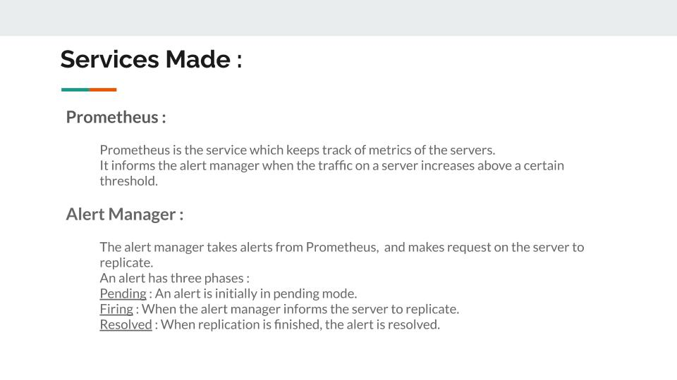
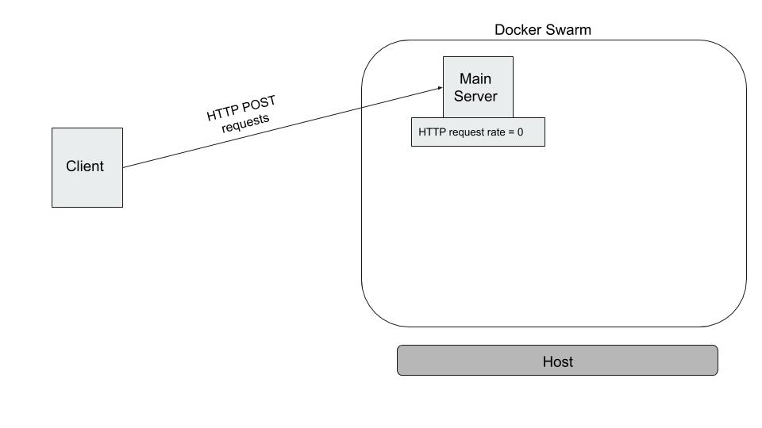
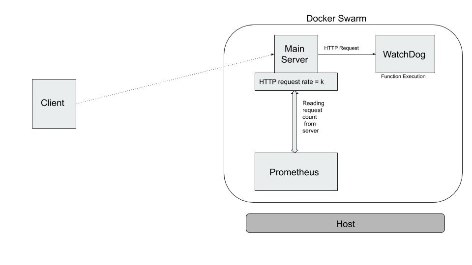
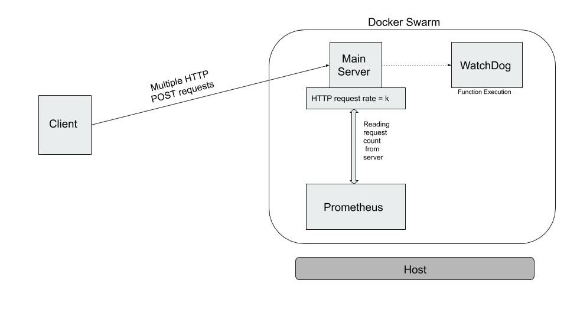
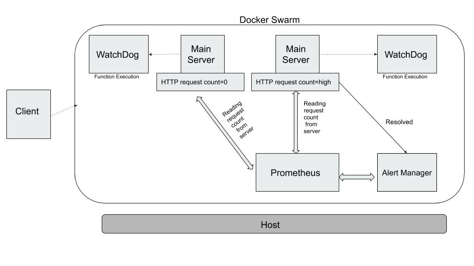
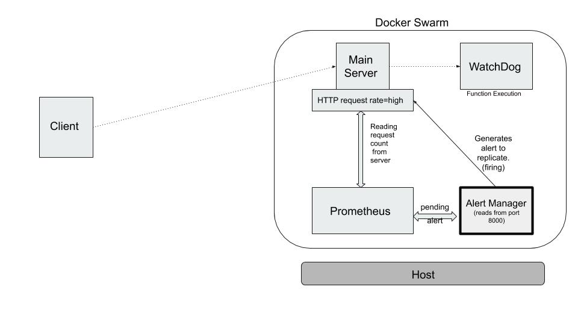
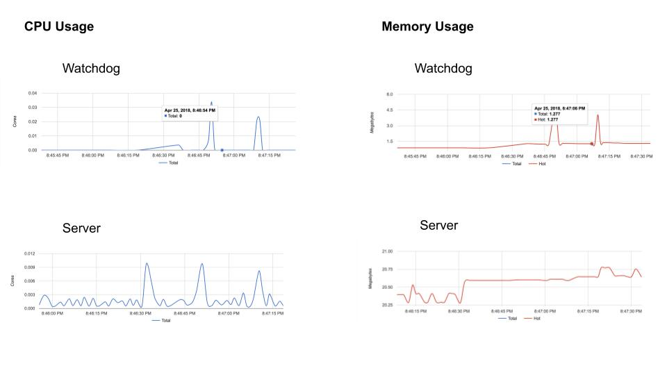

# Faasinate

A project to make serverless functions with Docker and Docker Swarm easier to implement with automated autoscaling.

Here for the sample the watchdog service converts code to latex. This can be  changed by the use case. 

## Usage

```
bash Runner.sh
```
##### To function
```
python test/tester.py
```


## Presentation (snapshots)












## Naive Example

```
Lightweight and low-traffic website
```
```
Assume 10,000 hits in a day at 200 ms (0.2 sec) execution time, 256 MB memory.
Let server running time be SR and memory required be M = (256/1024) GB = 0.25 GB.
```
```
The resource requirement (RR) (in GB-sec) is thus given by,
RR = SR * M
```
```
● Using FaaS
Server running time (SR) = 10,000 * 0.2 = 2,000 sec.
Therefore, resource requirement (RR) = SR*M = 2,000 * 0.25 GB-sec = 500 GB-sec per day.
```
```
● Using server-based architecture
As number of seconds in a day is 86400, SR = 86400 sec.
Therefore,resource requirement (RR) = SR*M = 86400 * 0.25 GB-sec = 21,600 GB-sec per day.
```
```
The above analysis shows that FaaS is ~ 43 times more resource efficient than server based architecture
in the given scenario.
```
